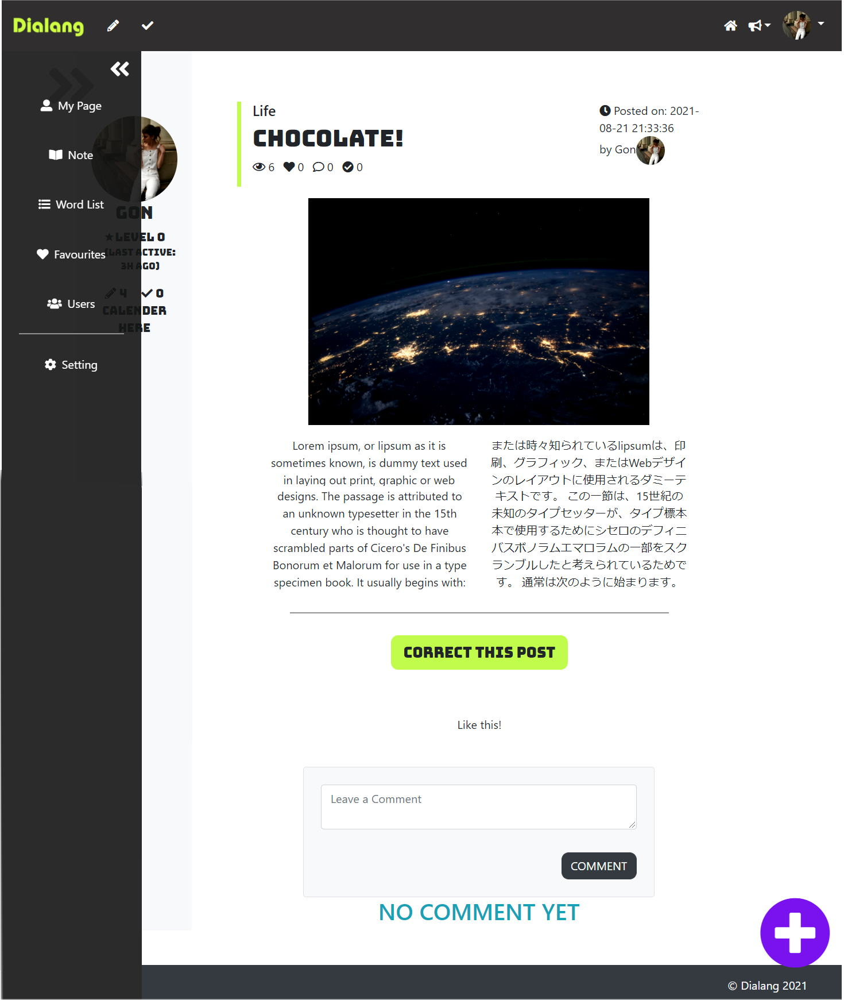

# Dialang
## Demo Video
<a href="https://www.veed.io/view/4128a155-69ca-4c7c-81cf-0616515ff801" alt="">⏩Click to watch🎥</a>

## MENU

<a href="#about">1. About This Project</a> <a href="#built_with">2. Built With</a> <a href="#features">3. Features</a> 

<h2>About this project</h2>
This is my original PHP project named "Dialang".  This is a CMS project. The reason I made this is I wanted to create a website where you can learn languages whilst interacting with people by posting articles and correcting in their native languages each other.

<h2>Built with</h2><ul><li>HTML</li><li>CSS</li><li>Bootstrap</li><li>Javascript</li><li>Procedual PHP (I had not learned Object oriented PHP at that time)</li></ul>

<h2>Features</h2>
This project is including the following features
<h3 style="margin-top: 30px;">1. User Authentification</h3><ul><li>Signing up<ul><li>Home (Before signing/loggin in)

</li></ul></li><li>Logging in

</li><li>Logging out</li></ul> <h3 style="margin-top: 30px;">2. Posts</h3><ul><li>View all posts<ul><li>You only can access this page only after logging in</li></ul>

</li><li>View a post<ul><li>You can see a post in both languages</li><li>You can see 'edit' and 'delete' buttons if it's your post</li></ul>

</li><li>Create a post<ul><li>You can write an article in your native language and your target language</ul></li></li><li>Edit a post you made</li><li>Delete a post you made with confirmation</li><li>Jump to the next/previous post</li></ul> <h3 style="margin-top: 30px;">3. User Page</h3><ul><li>View all users list<ul><li>You can jump to other users' profile page from here</li></ul>

</li><li>Visit MyPage<ul><li>This page contains all the posts you made and your profile information that you can edit </li><li>You can only see 'edit' and 'delete' buttons next to each post if it is your MyPage.</li><ul>

</li></ul> <h3 style="margin-top: 30px;">4. Setting</h3><ul><li>You can set your profile</li><li>You can change:<ul><li>profile picture</li><li>username</li><li>email address for logging in</li><li>native language</li><li>target language</li><li>profile comment</li></ul></li>

</li></ul> 
  
  <!--<h3 style="margin-top: 30px;">4. Category</h3><ul><li>You can create, edit and delete a new category</li><li>The categories will be on the navigation bar

</li></ul> <h3 style="margin-top: 30px;">5. Search</h3><ul><li>You can search a post by a keyword</li><li>The result will include all the posts that have the keyword in their title or content.

</li></ul> 
-->
